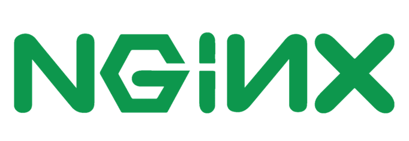

# Deliverable 1

## Concepts that I don't understand:
- Robust: An operating system or other program that performs well not only under ordinary conditions but also under unusual conditions that stress its designer's assumptions.
- Firewall: A solution or service that regulates, protects, and blocks network traffic as it passes to and from Linux-based environment.
- Nginx: NGINX is open source software for web serving, reverse proxying, caching, load balancing, media streaming, and more. 
- Nano: Nano is an easy to use command line text editor for Unix and Linux operating systems.

## Answer the following questions:

## Question 1: What is a web server? Hardware and software side
A web server is a computer that hosts a website on the Internet.

On the hardware side, a web server is a computer that stores web server software and a website's component files. A web server connects to the Internet and supports physical data interchange with other devices connected to the web.

ON the software side, a web server includes serval parts that control how web users access hosted files. At a minimum this is an HTTP server. An HTTP server is software that understand URLs and HTTP(the protocol your browser uses to view website). An HTTP server can be accessed through the domain names of the website it stores, it delivers the content of these hosted websites to the end user's device. 

## Question 2: What are some different web server application?
Some different web server applications can be found:

1. Apache

2. Nginx

3. Caddy

4. Lighthttpd

5. MonkeyServer

6. OpenLiteSpeed

7. Cherokee

## Q3: What is virtualization?
Virtualization is a replication of hardware to simulate a virtual machine inside a physical machine.

Two general types of virtualization:
- Server-side virtualization
Server-side virtualization provides a virtual desktop to each user

- Client-side virtualization
Software installed on a computer to manage virtual machines.

## Q4: What is virtualbox?
VirtualBox is a powerful type 2 virtualization product for enterprise as well as home use. Open source software under the GPL version 2
Capable of running on:
- Windows
- Linux
- Macintosh
- Solaris
- Supports a large number of guest operating system.

## Q5: What is a virtual machine?
A virtual machine is a computer resource that uses software instead of a physical computer to run programs and deploys appls. One or more virtual "guest" machines run on a physical "host" machine. Each virtual machine runs its own operating system and functions separately from the other VMs, even when they are all running on the same host. This means that, for example, a virtual MacOS virtual machine can run on a physical PC.

## Q6: What is Ubuntu Server?
Ubuntu Server is part of the larger set of Ubuntu products and operating system developed by Canonical Ltd. Ubuntu server is a specific addition that differs a little bit from Ubuntu desktop, in order to facilitate installation on servers.

## Q7: What is a firewall?
A Linux firewall is a solution or service that regulates, protects, and blocks network traffic as it passes to and from a Linux-based environment. 

## Q8: What is SSH?
SSH, also know as Secure Shell or Secure Socket Shell, is a network protocol that gives users, particularly systems administrators, a secure way to access a computer over an unsecured network. Secure Shell provides strong password authentication and public key authentication, as well as encrypted data communications between two computers connecting over ann open network, such as the internet.