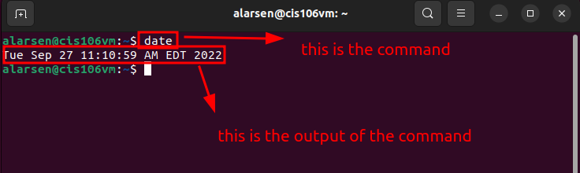
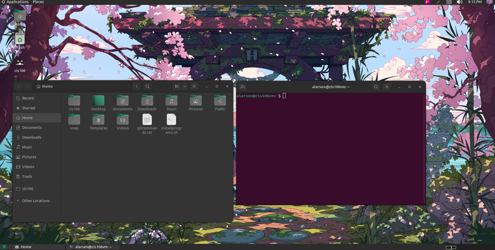

# Lab 3 Submission

## Question 1
Has no submission

## Question 2

## Question 3

| Program purpose     | Package Name     | Version                  |
| ------------------- | ---------------- | ------------------------ |
| Play a tetris game  | blockattack      | 2.7.0-1 amd64            |
| Play a video file   | dragonplayer     | 4.21.12.3-Oubuntu1 amd64 |
| Browse the internet | epiphany-browser | 42.4-0ubuntu1 amd64      |
| Read your email     | plasma-gmailfeed | 1.1-2 amd64              |
| Play music          | gnome-music      | 41.1-0ubuntu1 amd64      |

1. Which command did you use to install?
   sudo apt install 'package name'

2. Which command did you use to remove?
   sudo apt purge 'package name' 
   
3. Which command will you use install and remove?
   sudo apt install/remove 'package name here'

## Question 4
| command | what it does                                                   |
| ------- | -------------------------------------------------------------- |
| echo    | display a line of text                                         |
| fortune | print a random, hopefully interesting, adage                   |
| cowsay  | configurable speaking/thinking cow (and a bit more)            |
| lolcat  | rainbow coloring effect for text console display               |
| figlet  | display large characters made up of ordinary screen characters |
| toilet  | display large colorful characters                              |
| rig     | Random Identity Generator                                      |