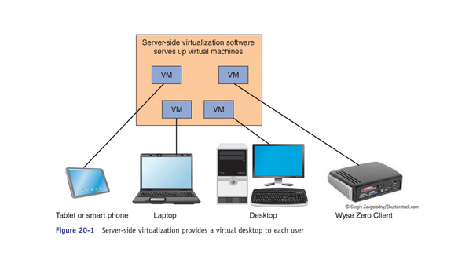
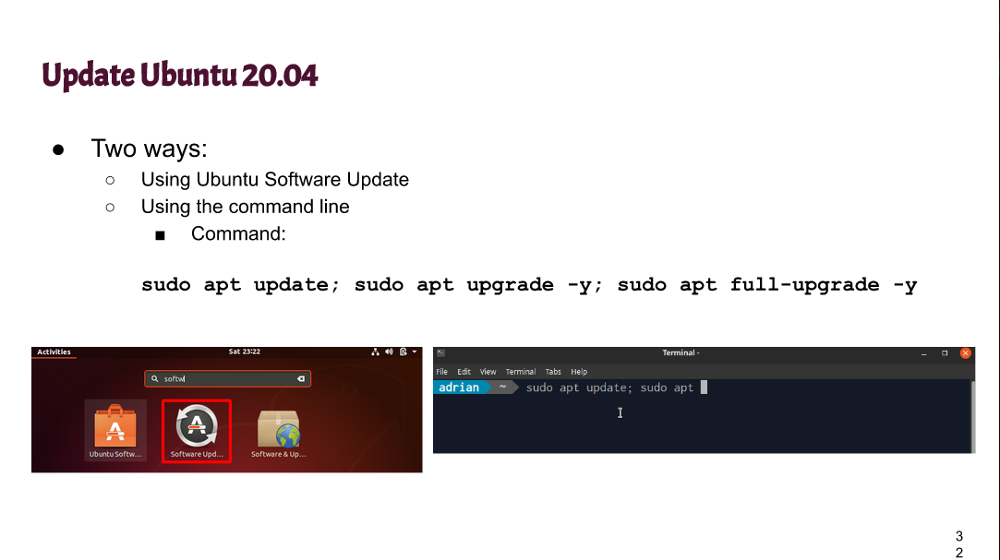
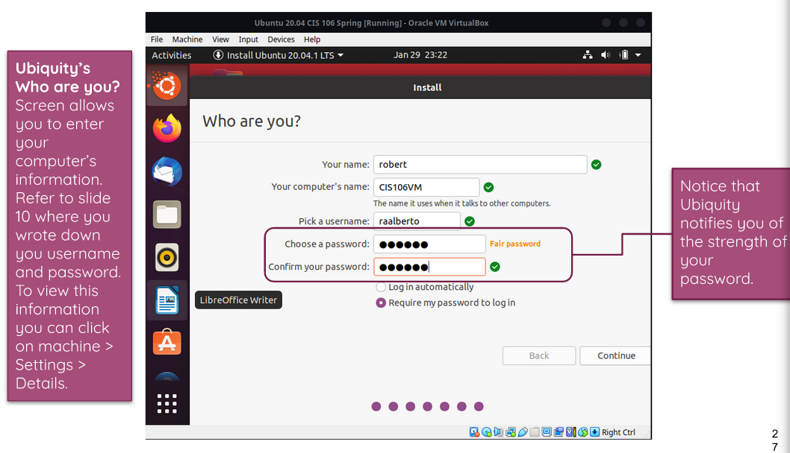
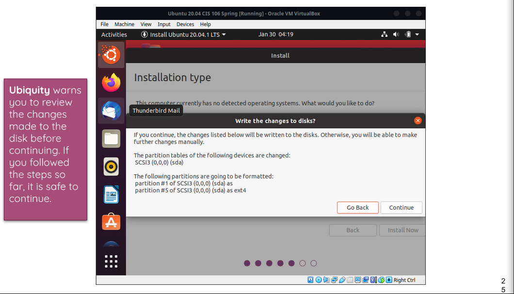
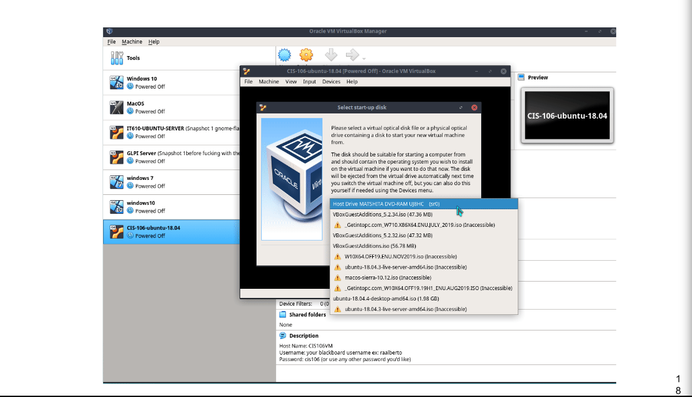
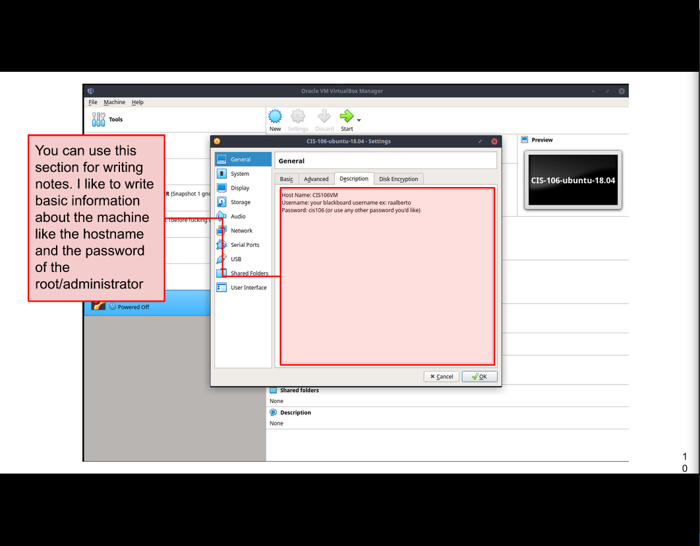

# Week Report 2

## The basics of virtualization

1. **what is virtualization**

Definition of virtualization: Replication of hardware to simulate a virtual machine inside a physical machine.

2. **Types of virtualization**
Server-Side virtualization
Definition: "A virtual desktop infrastructure"

Client-side virtualization
Definition: "Software installed on a computer to manage virtual machines"

## Installing Ubuntu in virtualization 
1. Ubuntu Update

2. Ubuntu Password

3. Ubuntu Warning 

4. Virtualization Startup

5. Ubuntu Description
