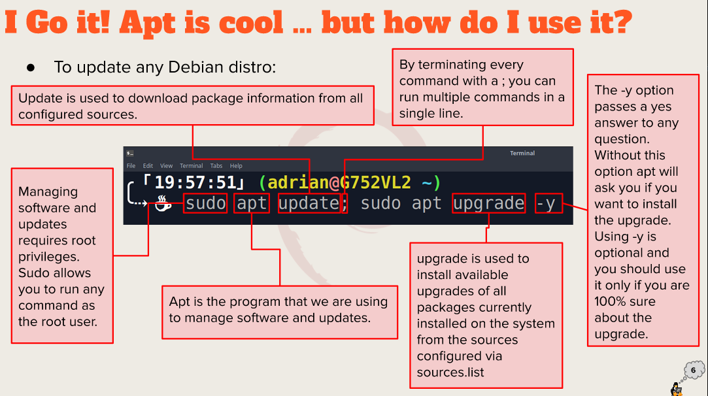

# Week Report 3

# Exploring Desktop Enviornments

A desktop envionrment provides a predetermined look and feel to the GUI. It is typically broken up into the following graphical sections and functions.

1. GNOME
2. KDE
3. XFCE
4. MATE
5. BUDGIE
6. LXDE
7. Cinnamon
8. OpenBox
9. LXQT
10. Pantheon
11. Deeping DE
12. Fluxbox

GUI: A graphical user interface is a set of programs that allows a user to interact with the computer system via icons, windows, and various other visual elements

DE: A desktop enviornment is an implementation of the desktop metaphor made of a bundle of programs running on top of a computer operating system, which shares a common GUI, sometimes described as a graphical shell. 

**Desktop Environments:**
1. Desktop Settings
2. Display Manager
3. File Manager
4. Icons
5. Favorites Bar
6. Launcher
7. Menus
8. Panels
9. System tray
10. Widgets
11. Window Manager

# The Bash Shell

The GNU bash shell is a program that provides interactive access to the Linux system. It runs as a regular program and is normally started whener a user logs in into a terminal.

**Different types of shells:**
1. Tcsh Shell
2. Csh Shell
3. Ksh Shell
4. Zsh Shell
5. Fish Shell

**Bash shortcuts:**
1. Ctrl + A: Go to the start of the command line
2. Ctrl + E: Go to the end of the command line
3. Ctrl + K: delete from cursor to the end of the command line
4. Ctrl + U: Delete from cursor to the start of the command line
5. Ctrl + W: Delete from cursor to start of word (i.e delete backwards one ward)
6. Ctrl + Y: paste word or text that was cut using one of the deletion shortcuts (such as the one above) after the cursor
7. Ctrl + XX: move between start of command line and current cursor position (and back again)

**Basic Commands and Usage:**
1. Date: Displays the current time and date
2. Cal: Displays a calendar of the current month
3. df: displays the current amount of free space on our disk drives
4. free: displays the amount of free memory
5. uname: displays information about your system
6. clear: clears the screen 

# Managing Software
Commands for:
1. Updating Ubuntu
   1. sudo apt update; sudo apt upgrade -y
2. Installing Software:
   1. sudo apt install [package name]
3. Removing Software:
   1. sudo apt purge firefox+ flameshot- caffeine- vlc+
4. Searching for software:
   1. apt search "web browser" 

**Definition of the following term:**
1. Package:
   1. Archieves that contain binaries of software, configuration files, and information about dependencies.
2. Library:
   1. Reusable code that can be used by more than one function or program. 
3. Repository:
   1. A large connection of software available for download. 

**Screenshot of the ubuntu update command**
