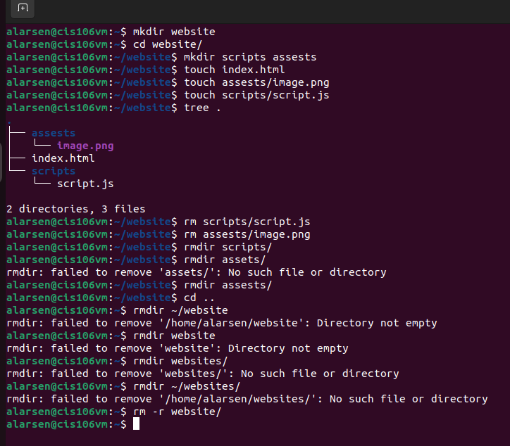
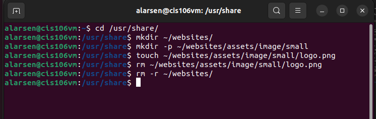
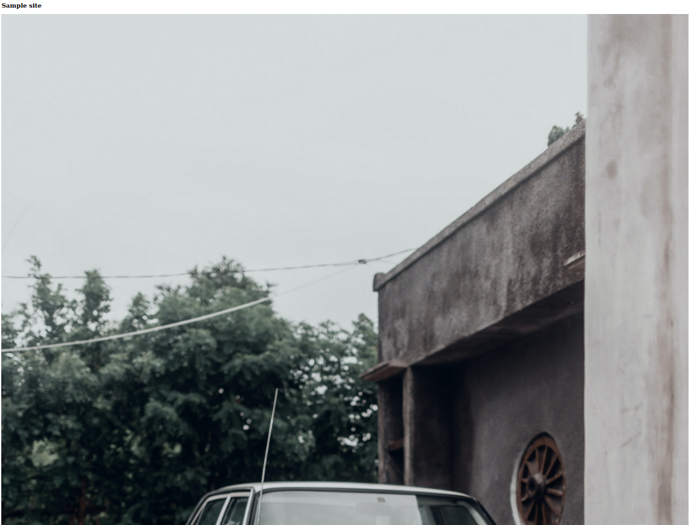
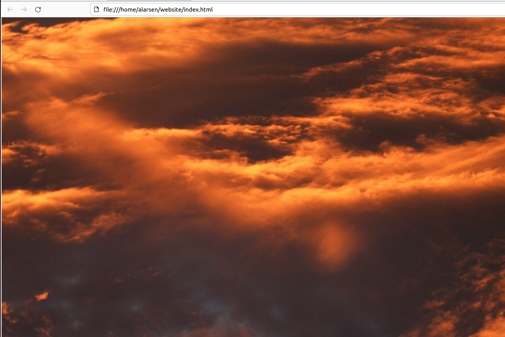
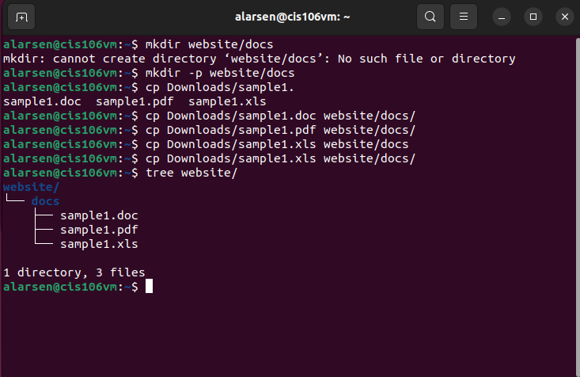

# Week Report 5

## Question 1
What are command options?
- Command are often followed by options that modify/enhance their behavior

## Question 2
What are command arguments?
- Commands are also followed by arguments which are the items open which the command acts on.

## Question 3
Which command is used for creating directories? Provide at least 3 examples.
The command used for creating directories is `mkdir`. The formula, `mkdir + the name of the directory`
## Examples
1. `mkdir wallpapers`
2. `mkdir wallpapers/ocean`
3. `mkdir ~/wallpapers/forest`

## Question 4
What does the touch command do? Provide at least 3 examples.
The touch command is used for creating files. 
## Examples
1. `touch list`
2. `touch list_of_cars.txt script.py names.csv`
3. `list of foods.txt`
## Question 5
How do you remove a file? Provide an example.
The command that removes file and directories would be the "rm" command.
## Example
1. `rm list`

## Question 6
How do you remove a directory and can you remove non-empty directories in Linux? Provide and example.

To remove a directory you would use the rmdir command.
(ex. rmdir Downloads/games)
To remove non-empty directories use rm -r + directory name or directory absolute path.
(ex. rm -r Downloads/games)

## Question 7
Explain the mv and cp command. Provide at least 2 examples of each.

The mv command moves and renames directories.
## Examples
1. `mv Downloads/homework.pdf Documents/`
2. `sudo mv ~/Downloads/theme /usr/share/themes`

The cp command copies files/directories from a source to a destination
The cp command uses the same structure as the mv command `cp + files to copy + destination`
To copy directories you must use the -r option
`cp -r + directory to copy + destination`

## Examples
1. `cp -r ~/Downloads/wallpapers ~/Pictures/`
2. `cp Downloads/wallpapers.zip Pictures/`

## Practice 1

## Practice 2

## Practice 3

## Practice 4
