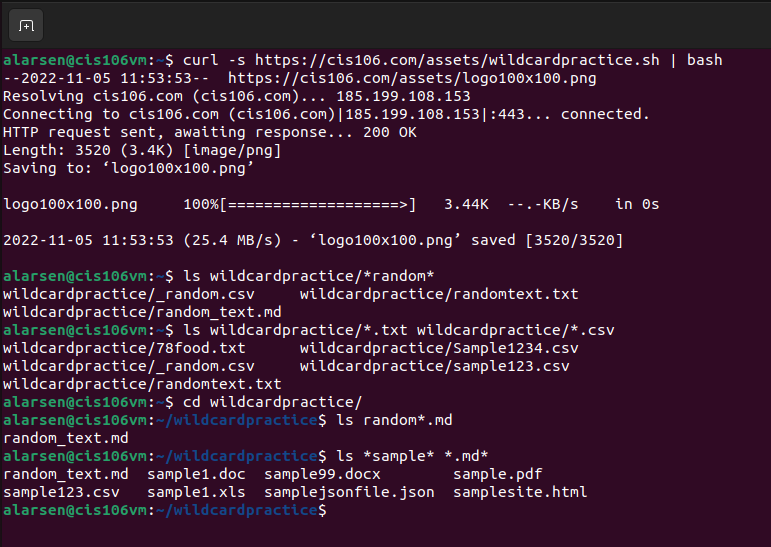
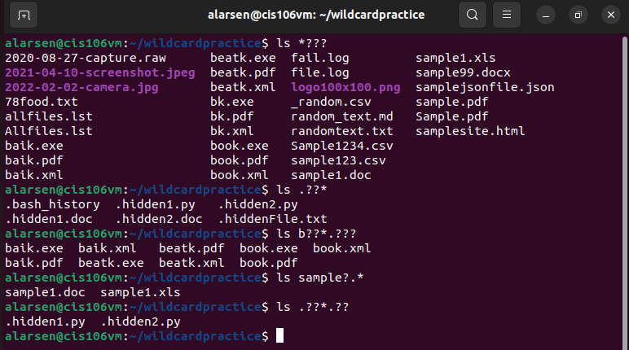
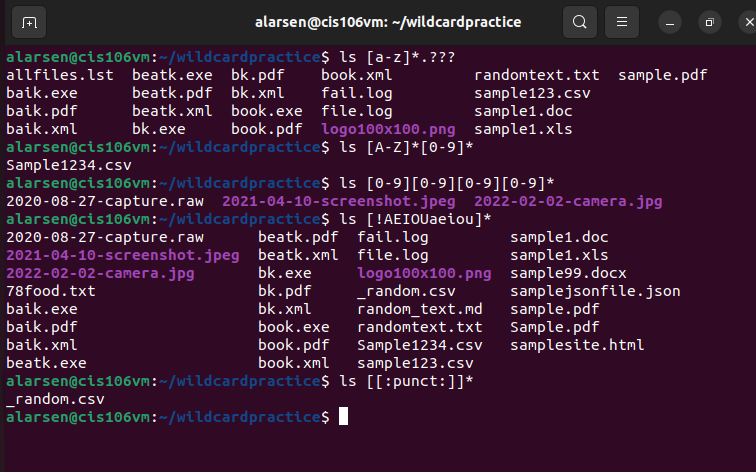

---
Name: Angel Larsen
Course: cis106
semester: fall 22
--- 

# Week Report 6

## Wild Cards.
Wildcard represents letters and characters used to specify a file name for searches. 
The importance of wildcard would be that:
1. YOu can use a wildcard to get a long lst of all files in the current directory starting with "new"
2. Move or delete a group of files
3. Create files and directories quicker.

## * Wildcard
The importance of the * Wildcard is that it's the main wildcard, it's able to match anything and nothing and matches any number of characters.
When you want to list all files with a particular file extension. 
When you want to copy, move, or remove all files that match a particular naming convention. 

## * Wildcard examples
1. `ls *.txt`
2. `ls *.txt *.pdf`
3. `ls file.*`

## ? Wildcard
The ? wildcard meta character matches precisely one character. 
The ? wildcard proves very useful
when working with hidden files.

## ? Wildcard examples
1. `ls ./. ?*`
2. `ls ../.??*`
3. `ls b??k*`
   
## [] Wildcard
The brackets wildcard match a single character in a range.
The brackets wildcard use the exlamation mark to reverse the match.

## The [] wildcard
1. `ls f[aeiou]`
2. `ls *[0-9]`
3. `ls [a-psc]`

## Brace expansion
Brace expansion {} is not a wildcard but another feature of bash that allows you to generate arbitrary strings to use with commands.
To create a whole directory structure in a single command:
`mkdir -p music/{jazz,rock}/{mp3files,videos,oggfiles}/new{1..3}`

To create N number of files use: 
`touch website{1..5}.html`
`touch file{A..Z}.html`
`touch file {001..10}.py`
`touch file {{a..z}, {0..10}}.js`

To remove multiple files in a single directory
`rm -r {dir1,dir2,dir3,file.txt, file.py}`

## Practice

## Practice 5:

## Practice 6:

## Practice 7:
